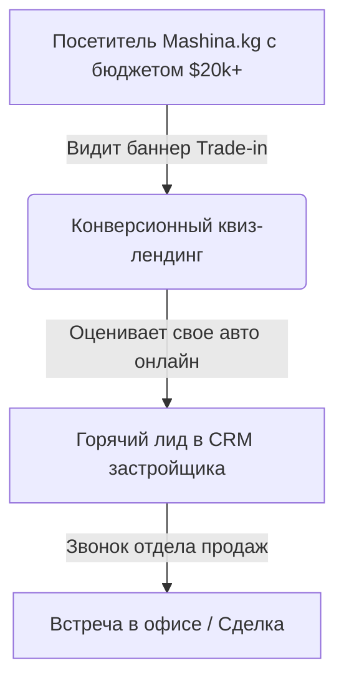

# СТРАТЕГИЯ ЛИДОГЕНЕРАЦИИ ДЛЯ СТРОИТЕЛЬНОЙ КОМПАНИИ
### Комплексный запуск: Google Ads, Yandex Direct, Mashina.kg и конверсионная воронка
**Разработано: Clima Marketing**

---

## СЛАЙД 1. Главный вызов рынка недвижимости Бишкека в 2026 году

Рынок новостроек Бишкека перенасыщен однотипной рекламой. Крупные игроки выкупают поисковые аукционы по широким запросам, из-за чего цена клика растет, а качество заявок снижается. 

> [!IMPORTANT]
> **Главная проблема:** 95% застройщиков рекламируют абстрактные ценности («элитный дом», «комфорт-класс»), соревнуясь только размером скидки.
>
> **Наше решение:** Перехват целевой аудитории с «живыми деньгами» на альтернативных площадках и внедрение Уникальных Торговых Предложений (Офферов), бьющих в конкретную потребность.

---

## СЛАЙД 2. Анализ конкурентов: Кейс Capstroy KG (Mashina.kg)

Конкуренты уже используют премиальные площадки для поиска платежеспособных клиентов. 

### Анализ баннера Capstroy KG (CAPS Plus) на Mashina.kg:
*   **Площадка:** Рекламный блок на главной и в поиске портала Mashina.kg (крупнейший автопортал КР).
*   **Оффер:** *«Один ключ может открыть больше. Обменяйте автомобиль на квартиру»*.
*   **Почему это работает:** Аудитория, продающая или ищущая автомобили в бюджете от **$15 000 до $80 000** на Mashina.kg, обладает свободным капиталом. Услуга **Trade-in (обмен авто на жилье)** закрывает их потребность в улучшении жилищных условий без необходимости долго продавать машину.



---

## СЛАЙД 3. Наша стратегия размещения: Google КМС и Yandex ADFOX

Чтобы показываться на Mashina.kg и ключевых порталах, строительной компании не нужно покупать дорогую прямую рекламу у площадок. Мы настроим это точечно через рекламные кабинеты.

### Каналы трафика:
1.  **Google Ads (КМС):**
    *   Таргетинг на конкретное приложение **Mashina.kg** (Android / iOS) и домен `mashina.kg`.
    *   Исключение «мусорного» трафика (блокировка показов в мобильных играх, детских каналах и развлекательных приложениях).
2.  **Yandex Direct (РСЯ + ADFOX):**
    *   Показы баннеров через систему ADFOX Яндекса на сайтах-партнерах.
    *   Нацеливание на аудиторию по интересам: «Инвестиции в недвижимость», «Покупка бизнес-класса», «Продажа авто».
3.  **YouTube-Видеореклама:**
    *   Запуск коротких промо-роликов (6 и 15 секунд) с облетом объекта на YouTube для жителей Бишкека, интересующихся недвижимостью.

---

## СЛАЙД 4. Архитектура конверсии: Как мы превращаем клики в договоры

Обычный сайт застройщика с кучей текста дает конверсию в заявку около 1-1.5%. Мы строим двухэтапную систему захвата контактов.

### Воронка продаж:
```
[Трафик: Mashina.kg + Google Search + Yandex РСЯ]
                       │
                       ▼
   [Квиз-Лендинг: Быстрый расчет условий рассрочки/обмена] (Конверсия ~6-8%)
                       │
                       ▼
       [WhatsApp-чат с ИИ-ассистентом / Квалификация]
                       │
                       ▼
      [Интеграция в CRM: Передача отделу продаж]
```

### Предлагаемые офферы для тестов:
*   **Оффер «Авто на квартиру (Trade-in)»:** *«Оцените ваш автомобиль онлайн за 3 минуты и узнайте размер доплаты за 1-2 комнатную квартиру в нашем ЖК»*.
*   **Оффер «Рассрочка»:** *«Беспроцентная рассрочка напрямую от застройщика до 5 лет с первоначальным взносом от $8 000»*.

---

## СЛАЙД 5. Пошаговый план работы (Сроки: 7 дней до первых лидов)

> [!TIP]
> Мы берем на себя всю техническую и маркетинговую часть «под ключ».

*   **День 1-2:** 
    *   Глубокий анализ конкурентов в Бишкеке.
    *   Разработка Уникальных Торговых Предложений (офферов) и ТЗ на дизайн баннеров (включая баннеры для формата Trade-in).
*   **День 3-4:**
    *   Создание продающего квиз-лендинга с интеграцией WhatsApp.
    *   Подготовка баннеров под все форматы (вертикальные для сторис, квадратные для ленты, баннеры для Mashina.kg).
*   **День 5-6:**
    *   Настройка сквозной аналитики (Meta Pixel, Google Tag Manager, Яндекс Метрика).
    *   Настройка рекламных кампаний на поиске Google/Яндекс и в сетях (КМС/РСЯ с таргетингом на Mashina.kg).
*   **День 7:**
    *   Запуск рекламы, прохождение модерации и получение первых заявок напрямую в отдел продаж.

---

## СЛАЙД 6. Пакеты услуг и гарантии Clima Marketing

Мы работаем по договору с юридической фиксацией KPI (количества целевых обращений).

| Пакет | Что входит | Стоимость (сом) |
| :--- | :--- | :--- |
| **Пакет «Трафик-Система»** | Разработка квиз-лендинга, баннеры, настройка Google Ads + Yandex Direct (Поиск + Сети + Mashina.kg), сопровождение 30 дней. | **55 000 сом** |
| **Пакет «Premium застройщик»** | Пакет «Трафик-Система» + запуск YouTube Video Ads, интеграция CRM (amoCRM/Bitrix24), автоматизация WhatsApp-ботом для первичной квалификации лидов. | **85 000 сом** |

> [!IMPORTANT]
> **Наша гарантия:** Если в течение 14 дней с момента старта кампаний при согласованном бюджете вы не получаете целевых заявок, мы возвращаем 100% стоимости наших услуг по договору.
